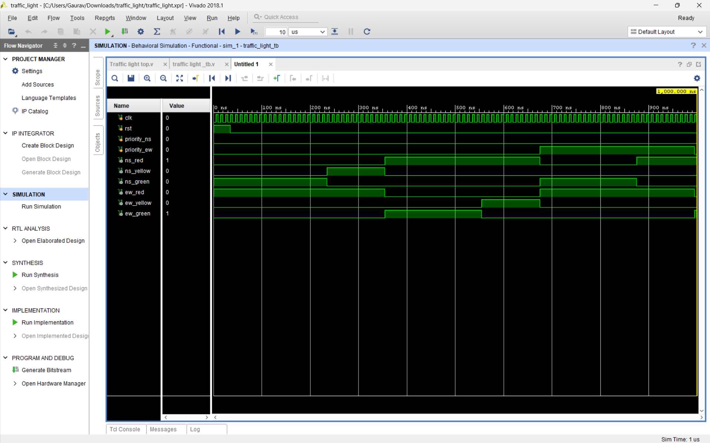

# 🚦 FPGA-Based Traffic Light Controller with Emergency Priority System

## 📖 Overview

An FPGA implementation of a 4-way intersection traffic light controller, built using **Verilog HDL** and a **Finite State Machine (FSM)**. The controller manages traffic signals for two perpendicular roads and includes an **emergency vehicle priority override** — the ability for an ambulance, fire truck, or police vehicle to force a green light in its direction, safely, without leaving cross-traffic caught mid-intersection.

The design was simulated in the Xilinx Vivado Simulator and successfully implemented on an FPGA development board, with hardware behavior matching simulation exactly.

## 🎯 Objectives

- Design a traffic light controller using Verilog HDL and a Finite State Machine.
- Implement an emergency vehicle priority override with a guaranteed safety buffer.
- Verify functionality through simulation before hardware deployment.
- Implement and validate the design on real FPGA hardware.

## ✨ Features

- Standard 4-phase traffic cycle (NS green → NS yellow → EW green → EW yellow)
- Emergency vehicle priority override for either direction
- Mandatory all-red safety buffer before granting priority green
- Fixed-priority arbitration if both directions request simultaneously
- Modular, synthesizable Verilog design
- Reset functionality to a known safe state
- Fully simulated and verified before hardware deployment

## 🛠 Hardware Used

| Component | Description |
|---|---|
| FPGA Board | Real Digital Boolean Board (Xilinx Spartan-7) |
| LEDs | Traffic signal indicators |
| Push Buttons | Reset & emergency priority inputs |
| Clock | 100 MHz on-board oscillator |

## 💻 Software Used

- Xilinx Vivado Design Suite
- Verilog HDL

## 📥 Inputs

| Input | Description |
|---|---|
| `clk` | System clock |
| `rst` | Reset button |
| `priority_ns` | North-South emergency request |
| `priority_ew` | East-West emergency request |

## 📤 Outputs

| Output | Description |
|---|---|
| `ns_red` | North-South red LED |
| `ns_yellow` | North-South yellow LED |
| `ns_green` | North-South green LED |
| `ew_red` | East-West red LED |
| `ew_yellow` | East-West yellow LED |
| `ew_green` | East-West green LED |

## 🏗 Architecture

The design is split into four modules, each with a single responsibility:

| Module | Responsibility |
|---|---|
| `clock_divider` | Converts the board's fast oscillator into a 1Hz `tick` used for all timing |
| `fsm_controller` | Core state machine — normal cycle + priority override logic |
| `output_decoder` | Maps the current state to the 6 physical light outputs |
| `traffic_light_top` | Top-level wiring connecting the above modules to physical pins |

See [`docs/state_diagram.png`](docs/state_diagram.png) for the full visual state diagram.

## 🧠 Finite State Machine

The controller consists of seven states:

| State | Description |
|---|---|
| `NS_GREEN` | North-South green |
| `NS_YELLOW` | North-South yellow |
| `EW_GREEN` | East-West green |
| `EW_YELLOW` | East-West yellow |
| `ALL_RED` | Safety delay before granting priority |
| `PRIORITY_NS` | Emergency priority (North-South) |
| `PRIORITY_EW` | Emergency priority (East-West) |

## ⚙ Working Principle

On every tick:
1. Decrement the current state's timer.
2. If not yet zero, stay in the current state.
3. If zero, check for a pending priority request:
   - No request → advance to the next state in the normal cycle.
   - Request pending → branch into `ALL_RED` (2s safety buffer) before granting priority green.
4. Priority green holds until the request clears, then the cycle resumes from `NS_GREEN`.

Priority is only checked at state boundaries (not mid-state), so an in-progress green/yellow phase always finishes naturally before the safety buffer engages. If both directions request priority simultaneously, a fixed rule resolves the conflict (EW wins if both fire during NS_GREEN, NS wins if both fire during EW_GREEN).

See [`docs/flowchart.png`](docs/flowchart.png) for the visual decision flow.

## 📈 Results & Evidence

✔ Successful functional simulation
✔ Successful RTL synthesis
✔ Successful FPGA implementation
✔ Successful bitstream generation
✔ Correct FSM operation and state transitions
✔ Correct priority override behavior
✔ Hardware verification completed

**Simulation waveform:**

The waveform confirms correct timing and state transitions, matching the algorithm above.

## 🎥 Hardware Demonstration

On power-up, the FPGA board runs the synthesized traffic light controller, starting with North-South green and East-West red — the normal operating condition. After the programmed interval, North-South transitions to yellow, then East-West receives green, and the cycle continues, confirming correct FSM operation.

Pressing an emergency priority button triggers the controller to first transition both directions to all-red, ensuring intersection safety, before granting green exclusively to the requested direction. Releasing the button returns the controller to the normal cycle, restarting from North-South green.

The reset button was also tested and immediately restores the controller to its known safe initial state (North-South green, East-West red) regardless of what state it was in beforehand — this is what guarantees the system always starts predictably, both in simulation and on hardware.

Hardware behavior matched simulation results exactly, confirming the correctness of the Verilog implementation and FPGA deployment.

## ▶️ How to Run

### Simulation (Vivado)
1. Open Vivado and create a new RTL project targeting the Real Digital Boolean Board.
2. Add `src/traffic_light_top.v` as a design source.
3. Add `testbench/traffic_light_tb.v` as a simulation source.
4. Run Behavioral Simulation and observe the waveform.

### FPGA Implementation
1. Add `constraints/traffic_light.xdc` as the constraints file.
2. Run Synthesis → Implementation → Generate Bitstream.
3. Program the FPGA via Hardware Manager.
4. Test using the onboard push buttons and LEDs.

## 🚀 Future Improvements

- Button debouncing for reliable physical input handling
- Pedestrian crossing signal
- Countdown timer on a seven-segment display
- Configurable priority arbitration (alternating instead of fixed)
- Vehicle density detection / adaptive traffic control
- IoT monitoring dashboard

## 📚 Learning Outcomes

This project provided practical experience in:
- Verilog HDL and RTL design
- FPGA design flow (synthesis, implementation, bitstream generation)
- Finite State Machine design
- Simulation-driven verification before hardware deployment
- Hardware debugging and pin-constraint mapping

## 👨‍💻 Author
[Your name here]
